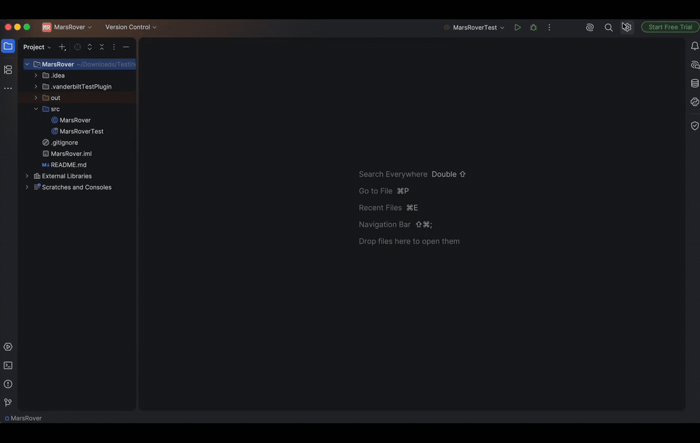

# TestCompass

<p align="center">
  
</p>

[TestCompass](https://plugins.jetbrains.com/plugin/30034-vandytest) is an IntelliJ IDEA plugin that helps students understand where their tests are weak. It reads IntelliJ's active coverage data, ranks under-tested production methods, and can generate conceptual test recommendations.

<!-- Plugin description -->
Provides an IntelliJ Platform plugin that identifies coverage hotspots from the IDE's coverage data, shows them in a dedicated tool window, and generates AI-powered test recommendations for the most under-covered methods. Intended for educational use, it highlights weakly tested code and offers guidance without generating test code directly.
<!-- Plugin description end -->

## Install From JetBrains Marketplace

1. Open IntelliJ IDEA.
2. Go to `Settings > Plugins > Marketplace`.
3. Search for `TestCompass`.
4. Install the plugin from the JetBrains Marketplace listing:
   `https://plugins.jetbrains.com/plugin/30034-vandytest`
5. Restart IntelliJ IDEA if prompted.

## Install From Disk (If you cannot find the plugin from the Marketplace)

If TestCompass does not appear in the JetBrains Marketplace:

1. [Download TestCompass 0.0.7](https://github.com/littlehousezh/test_plugin/raw/main/dist/TestCompass-0.0.7.zip). Do not extract the ZIP file.
2. Open IntelliJ IDEA.
3. Go to `Settings > Plugins`.
4. Click the gear icon and select `Install Plugin from Disk...`.
5. Select the downloaded TestCompass ZIP file and click `OK`.
6. Restart IntelliJ IDEA if prompted.
7. Open the project you want to test, such as the MarsRover project.

## First-Time Setup

Open IntelliJ IDEA `Settings` (`Preferences` on macOS), search for `TestCompass`, and enter:

- `Amplify token`: the token provided by the instructor.

Paste the raw token. A leading `Bearer` prefix is not required. You can also leave the field blank initially; TestCompass will ask for the token when you first click `Generate recommendations`. If you prefer to set it up manually, go to `Settings` → `Other Settings` → `TestCompass`, then paste your token there.

## How to Use TestCompass

1. Open the project in IntelliJ IDEA.
2. Open or create the JUnit test file for the project.
3. Run the relevant tests with IntelliJ coverage:
   - Right-click the test class, test folder, or project.
   - Select `Run '<name>' with Coverage`. The exact name depends on what you selected.
   - Wait for the tests and coverage calculation to finish.
4. After IntelliJ finishes calculating coverage, TestCompass runs automatically and opens or updates its tool window on the right side.
   - Click the `TestCompass` tool-window icon to show the current results if the window is hidden.
   - Select `Tools > TestCompass` at any time to run the analysis manually or refresh it from the active coverage suite.
5. In the TestCompass tool window, review the ranked production methods. Methods with more missed lines appear first.
6. Click `Generate recommendations`.
   - If no Amplify token is saved, enter the instructor-provided token in the setup dialog and click `OK`.
   - Generating and checking the recommendations may take a little while. You can monitor the current progress at the bottom of the IntelliJ IDEA window.
7. Review the conceptual test recommendations.
8. Add or improve the JUnit tests in your project.
9. Run the tests with coverage again. TestCompass automatically analyzes the new coverage result and refreshes its tool window.

## Important Usage Notes

- Run tests **with coverage before starting TestCompass**. A normal test run does not create the coverage data that TestCompass needs.
- Every completed IntelliJ coverage calculation automatically runs TestCompass using that new coverage result.
- `Tools > TestCompass` remains available when you want to run the same analysis manually using the currently active coverage suite.
- Recommendations are based on missed production lines and branches. Fully covered behavior may appear under `Already covered` instead of being recommended again.

## Troubleshooting

### No active coverage suite

Run the relevant tests using `Run '<name>' with Coverage`, wait for coverage to finish, and then start TestCompass again.

### The TestCompass table is empty

Confirm that the active coverage run includes production classes from the current project, not only library or test classes. Then select `Tools > TestCompass` to refresh the analysis.

### Recommendations cannot authenticate

Open IntelliJ IDEA `Settings`/`Preferences`, search for `TestCompass`, and replace the saved Amplify token with a current token from the instructor. Paste only the raw token.


## Build For Marketplace

This project uses Gradle and the IntelliJ Platform Gradle Plugin. Java 25/26 requires Gradle 9.4 or newer; the wrapper is configured for Gradle 9.6.1.

```bash
./gradlew buildPlugin
```

The uploadable Marketplace ZIP is generated in:

```text
build/distributions/
```
